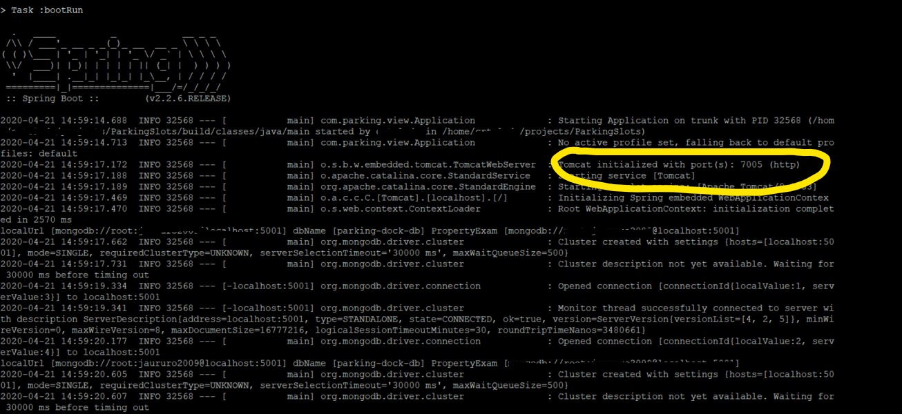

# parking-spots

Back-End Application to manage parking spots

## Prerequisites  
- Java JDK 9 or higher (Configured JAVA_HOME as environment variable).   
- MongoDB 4.0.10 or higher.  
-----------------------
## Installation  
- Step 1:  Download project.
```
git clone https://github.com/wutzcrtoledo/parking-spots.git
```  
- Step 2: Configure Properties.  
Find properties file located at path "src/resources".  
On this file we can see the following properties.  
```
mongo.url=mongodb://localhost:27017
mongo.db=parking-dock-db
server.port=7005
```  
- "mongo.url" represents the connection string to your mongodb database.  
"mongo.db" is database name which the application would connect to. This database must exist in your local MongoDB.  
"server.port" Is the port where our application will be listening for requests. In our case we are using 7005.

Modify properties based on your local configuration 

- Step 3: Build and Run Project.  
Open a terminal in root folder of our project and type  

**Windows**
```
> .\gradlew bootRun
```
**Linux/Mac**
```
> ./gradlew bootRun
```

- Step 4: If everything went well. We should see an screen like this



At this point. Backend application should be listening fo requests at configured port.   
We can start running our endpoints. 

-----------------------

## Requirements, Design and Architecture    
This small project has an initial design. You can take a look **[HERE](design/index.md#Design-Project-Parking-Spots)**  

-----------------------

## API  
Application Rest API **[HERE](api/index.md#API-Parking-Spots)**  

-----------------------

## Testing  
Data Populate and Test Plan **[HERE](TestPlan/README.md#Test-Plan)**  

-----------------------

## Pending Enhancements and Observations.
Following we have a list of pending items to be enhance/fixed. 
Each item will be removed as they are addressed.  

- ~~**Proper Exception Distribution:**   
In current solution if there's an exception through a endpoint call 
life cicle. This is catched and returns error payload and status 500 (Internal Error).
The idea of this enhancement is to manage each exception with its respective 
standar status. For instance if endpoint doesn't exist. We should return error 404. 
In case of unauthorize access error 401 and so on.~~ 

- ~~**Add Security to formulas's format:**   
Currently there's a function that calculates price based on custom formulas that are saved as String.  
We need to make sure than that formula doesn't include malware code. Avoiding any type of code injection.~~    

- **Add Auth Security Components:**  
Currently this application is not handlering proper authentication for private endpoints. 
Right now private endpoints require Authorization header. However just sending any value 
would grant access to the endpoint. 
A proper Auth structure needs to be build. Where admin user authenticate and system returns 
a temporal session token (15 minutes duration), and use this token as part of private 
endpoint header. 

- **Pagination for large results:**   
On endpoint where no filter is included. The system is returning all results at once. For largest business where 
we can have thousands of parking spots. We need to add a proper bulk pagination response.

- ~~**Move Development Implementation to newer technologies:**  
Now we are compiling and packaging through ANT. Plus, dependencies are uploaded to the repository.
This is not suitable for new age projects, where there are tools to make this simpler.~~

- **Add properties option to handlered as environment variable:**  
A secure way to save application creadentials is via environment variables. We should support environment variables for our properties.