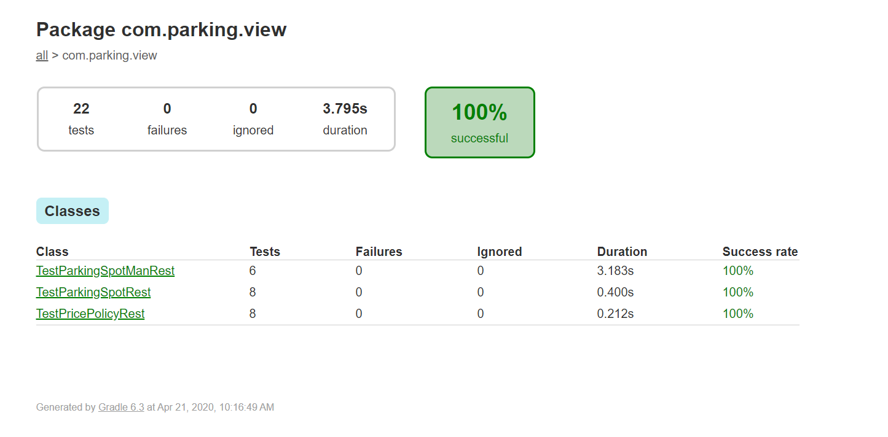
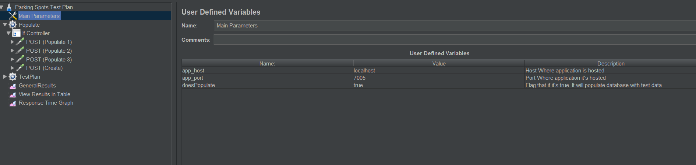

[Back To README](../README.md#Testing)

# Test Plan

## JUnit Test Plan

There's a preconfigured Spring Boot MVC test plan available.   
The plan it self is located under path "src/test".  
In order to execute JUnit test plan, open a terminal in root folder of our project and type  

**Windows**
```
> .\gradlew test
```
**Linux/Mac**
```
> ./gradlew test
```

This command would execute current JUnit test plan. Creating a result report and saving it at path 
"build/reports/test/test". You can check at the generated report by opening index.html file. 
It should looks like this. 



You can see an example of this report at ["TestPlan/test-report-example/index.html](TestPlan/test-report-example/index.html?target=_blank){:target="_blank"}.


## JMeter Test Plan.

### Prerequisite
Being familiar on basic concepts of JMeter application.  
Documentation can be found at [https://jmeter.apache.org/](https://jmeter.apache.org/){:target="_blank"}

In order to populate and also test services. A test plan compatible with JMeter was created.   
You can find this file under "TestPlan" folder called "Parking Spots Test Plan.jmx".  
Once imported into JMeter, there are a couple of items to pay attention.

In one hand you have some parameters to modify at "Main Parameters" component.



There are 3 parameters to configure.  
- app_host: Host where application is hosted
- app_port: Host where application is hosted
- doesPopulate: Flag that if it's true. It will populate database with test data.

Once configured. We are ready to start the execution of our test plan. 


[Back To README](../README.md#Testing)