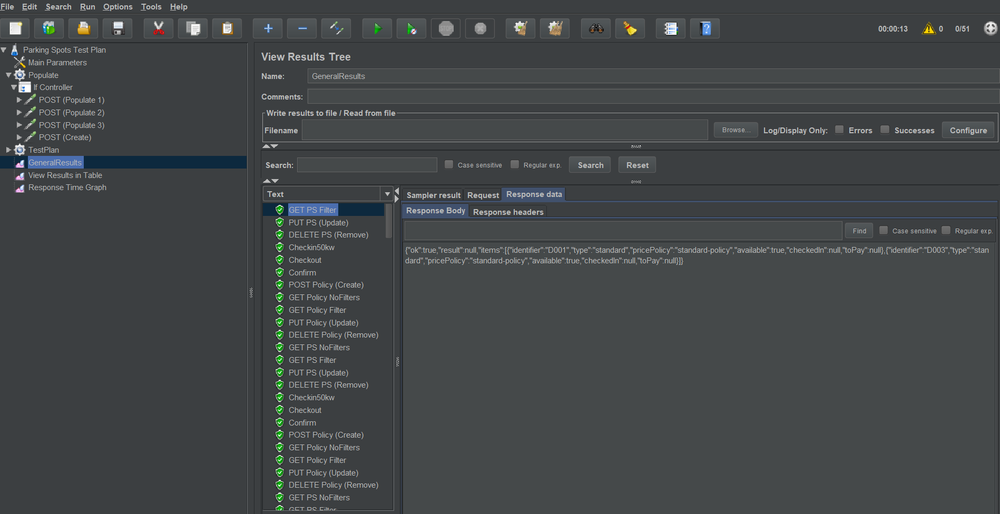

[Back To README](../README.md#Testing)

# JMeter Test Plan.

To populate and test services. A test plan compatible with JMeter was created.   
You can find this file under TestPlan folder called "Parking Spots Test Plan.jmx".  
Once imported into JMeter, you'll see two main threads "Populate" and "TestPlan".
In case you want to import new test data. Make sure that flag "doesPopulate" is true
like you can see in the following image.  

Otherwise set it as false. 

Under "TestPlan" thread, there are test urls for each endpoint available in the system. 
You can change accordingly to your needs. 

[Back To README](../README.md#Testing)