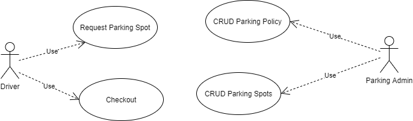
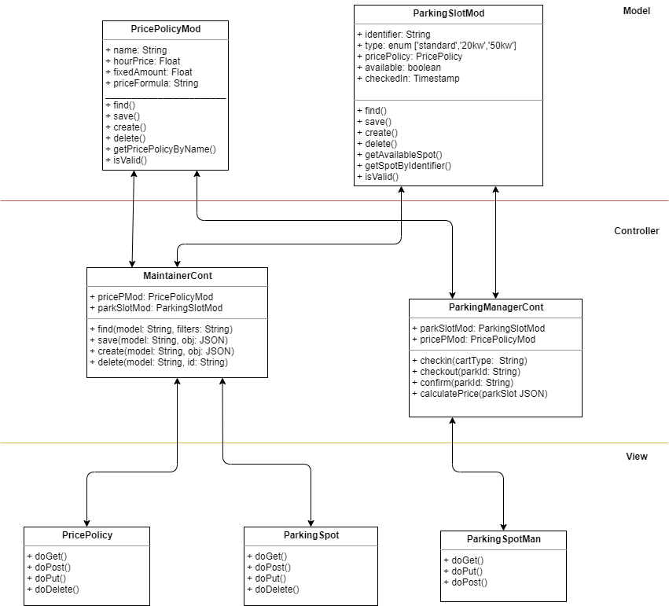

[Back To README](../README.md#Design-and-Architecture)

# Design Project Parking-Spots

## Use Case 

Per requirements the following Use Cases and Actors were idenfitied.

### Actors Definitions

**Driver:** System user which requires to reserve a parking spot. And eventually checkout and pay for its visit. This actor can provide input data related to car type that needs to be parked. Possible type of cars are ‘gasoline’, ’electrinc-20kw’, ’electrinc-50kw’.

**Parking Admin:** System user which maintains base information for parking. This actor can provide input data about Parking Policies and available Parking spots.

### Case Use Definitions

**Case Use:** CRUD Parking Price Policy  
**Actors:** Parking Admin.  
**Prerequisite:**  User must be logged in.  
**Description:** User access to module Parking Policy. System returns a list with all current available policies with filtering options. Always giving the option to ‘Create New Price Policy’. In case than the list is not empty, system also gives the option to either Edit / Delete any of the existing policy.  
If user pick ‘Delete’. The system remove the picked policy.  
In case of select ‘Create’ or ‘Edit’. System returns form with policy input info:  
•	Name: Identifier for policy.  
•	Hour Price (hp): Price per hour that car uses parking spot. Mandatory field  
•	Fixed Amount (fa):  Fixed price to be use. By default is 0.  
•	Price Formula: Formula applied to calculate price to pay. By default the formula is ‘fa + hp*nh’. Being nh the number of hours that car used parking spot.  
•	Apply to: List of parking spots this Parking Policy will be applied. By default is ‘ALL’, meaning that the policy will be applied to all spots as second priority.  
User save changes. System apply changes internally.  
End of case of use.  

----------

**Case Use:** CRUD Parking spots  
**Actors:** Parking Admin  
**Prerequisite:**  User must be logged in.  
**Description:** User access to module Parking spots. System returns a list with all current available spots with filtering options. Always giving the option to ‘Create New spot. In case than the list is not empty, system also gives the option to either Edit / Delete any of the existing spot.  
If user pick ‘Delete’. The system remove the picked spot.  
In case of select ‘Create’ or ‘Edit’. System returns form with policy input info:  
•	Identifier: String that’s used as unique identifier. Can be either a plain number or identify areas (example ‘A25’, ‘C103’, etc.). Mandatory field.  
•	Type: Type of parking spot. Could be ‘standard’, ‘20kw’ or ‘50kw’. Mandatory field.  
•	Price Policy: Price policy previously created to apply over this parking spot.  
•	Available: Boolean that specify if spot is available or busy. Default true  
User save changes. System apply changes internally.  
End of case of use.  

----------
**Case Use:** Check-in  
**Actors:** Driver  
**Description:**  User access system access system requesting for new parking spot. User needs to select the type of car to be checked in.  
User selects car type. System checks for availability of parking spot for type of car selected. If system doesn’t find any spot for selected type of card of card then show proper message.  
If system does find a spot. System mark available spot as ‘not available’ and also save current timestamp as checking access. System returns to user marked spot identifier.  
End of Case of Use.	
 
----------

**Case Use:** Check-out  
**Actors:** Driver  
**Prerequisites:** User must Checked-in before access this module.  
**Description:**  User access system access system requesting to checkout.  
User provides parking spot identifier provided previously in Check-In Use Case.
System calculates ‘nh’ (number of hours that car used parking spot). Taking current timestamp – checkin timestamp. Once having ‘nh’ system uses price policy associated to the spot and calculate final price based of policy’s formula. 
System returns final price to user. 
User confirms payment. System clean checkin timestamp field and mark spot as ‘available’.
End of Case of Use.

----------

## Class Model

[Back To README](../README.md#Design-and-Architecture)